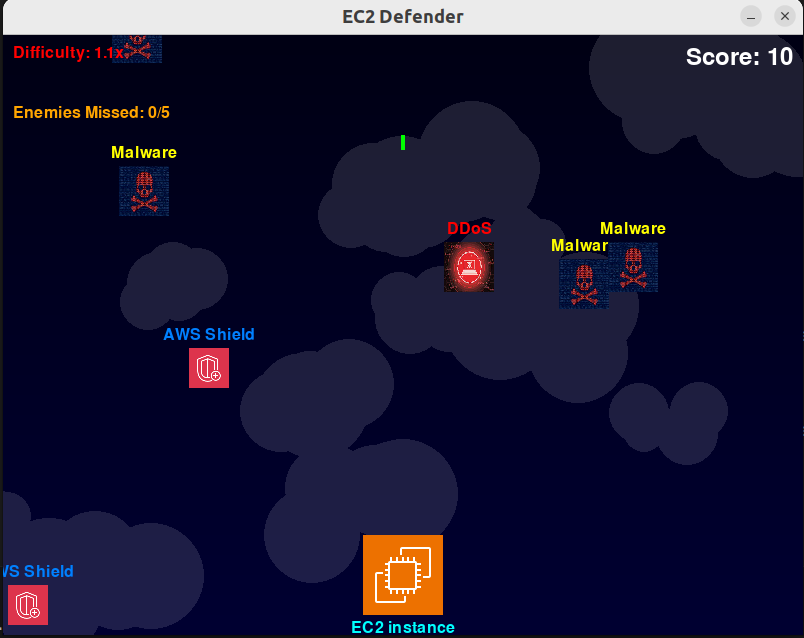

# EC2 Defender

A space-themed arcade game where you defend your EC2 instance from DDoS and Malware attacks. Developed using Amazon Q CLI.



## About the Game

EC2 Defender is a PyGame-based arcade shooter where you control an EC2 instance that must defend against incoming cyber threats. As the game progresses, the difficulty increases with enemies moving faster and spawning more frequently.

### Features

- Space-themed background with AWS-themed elements
- Two enemy types: DDoS attacks and Malware
- Power-ups: AWS Shield and AWS WAF for temporary invincibility
- Increasing difficulty over time
- Score tracking system
- Game over when 5 enemies reach the bottom

## Installation

### Prerequisites

- Python 3.10.12
- PyGame library

### Setup

1. Clone this repository or download the source code:
   ```
   git clone <repository-url>
   cd ec2-game
   ```

2. Install PyGame if you don't have it already:
   ```
   pip install pygame
   ```

3. Run the game:
   ```
   python space_game.py
   ```

## How to Play

### Controls

- **LEFT/RIGHT Arrow Keys**: Move your EC2 instance horizontally
- **SPACEBAR**: Shoot lasers to destroy enemies
- **ESC**: Quit the game

### Gameplay

- Defend your EC2 instance from falling DDoS and Malware attacks
- Shoot enemies to earn points (DDoS: 20 points, Malware: 10 points)
- Collect power-ups for 5 seconds of invincibility:
  - AWS Shield: Provides protection against all attacks
  - AWS WAF: Provides protection against all attacks
- Game ends when 5 enemies reach the bottom of the screen

## Assets Used

The game uses the following assets:

- `ec2.png`: Player character (EC2 instance)
- `ddos.png`: DDoS attack enemy
- `malware.png`: Malware enemy
- `shield.png`: AWS Shield power-up
- `waf.png`: AWS WAF power-up
- `background.png`: Cloud-themed background

## Development

This game was developed using:
- Python 3.10.12
- PyGame library
- Amazon Q CLI for assistance with code development

## Future Enhancements

Potential future improvements:
- Additional enemy types
- More power-ups and defensive capabilities
- Multiple levels with increasing difficulty
- High score tracking
- Sound effects and music

## License

[Include license information here]

## Acknowledgments

- Developed with assistance from Amazon Q CLI
- AWS-themed assets used for educational purposes
